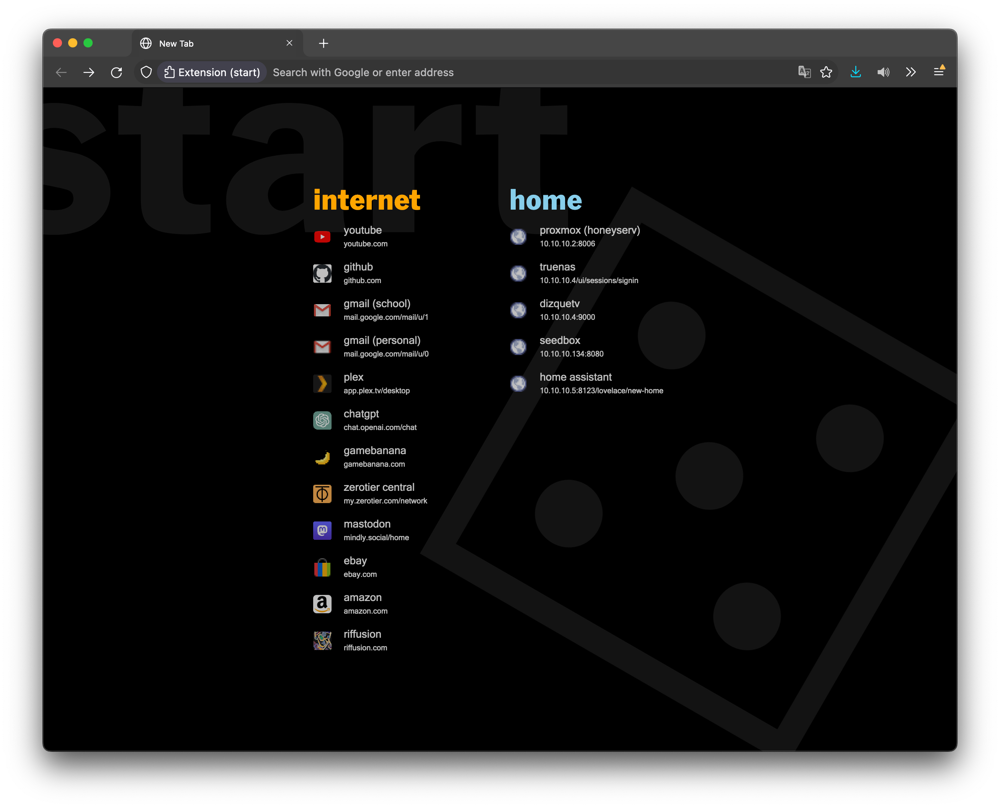

## Preview

## WARNING

This sends domain URLs to Google (to get high quality favicons) and Yandex (to bypass CORS restrictions and get low quality favicons for highlight colors). If you're not okay with this, then set `FAVICONS: false` in `options.js`. Pull requests with solutions to this are welcome.

## Notes

-   In Firefox you'll have to manually set the home page.
    -   Check the console for the URL in a new hello-friend tab
-   In Chrome remove the `applications` object in the `manifest.json` this is Firefox only

## Local development

Clone the source

    git clone git@github.com:jaywick/hello-friend.git

Firefox

1. Go to `about:debugging` in address bar
2. Click _Load Temporary Add-on_ button on top right
3. Open any file at root directory of this extension's source

Chrome

1. Go to `chrome://extensions/` in address bar
2. Tick _Developer mode_ toggle at top right
3. Click _Load Unpacked_
4. Choose the directory of this extenson's source code
